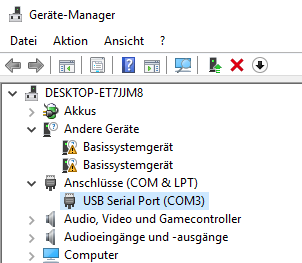

# Python-Measurement-Application
Measure different instruments, log that data in real time on screen and save it automatically to a text file. 
Plot up to 3 instrument values over time. Set measurement and connection properties or choose which instrument should be
used within the comfort of a GUI. Same for parsing the measured data to csv format with/without header. 

Get a first glance of the program by watching this youtube video: 

# Requirements

- Python 3 --> https://www.python.org/

### Python modules
To install modules I used pip, which is preinstalled when downloading Python 3 (version >= 3.4) from the official
website(see link above). When searching for python packages(modules) use: https://pypi.org/ (there one can find the
pip command to install the package and the latest version of the documentation)

- pyserial --> https://pypi.org/project/pyserial/
- minimalmodbus --> https://pypi.org/project/MinimalModbus/
- pyvisa --> https://pypi.org/project/PyVISA/
- matplotlib --> https://pypi.org/project/matplotlib/
- pillow --> https://pypi.org/project/Pillow/

### NI Visa Driver
With the above Python modules installed we aren't done because the PyVisa module needs a backend to work so we 
have to install: http://www.ni.com/download/ni-visa-17.5/7220/en/ which basically is a C libary and the PyVisa
module offers a easy to use Python API for it. For more information read the docs: https://pyvisa.readthedocs.io/en/master/index.html

We are using a GPIB connection for the Keithley2000 instrument so we need the following:

- http://www.ni.com/de-at/support/model.gpib-usb-hs.html
- http://www.ni.com/de-at/support/downloads/drivers/download.ni-488-2.html#305442

### Serial to USB converter
Some Instruments like the Fmi220 are using an old RS232 interfacefor which we need an serial to usb converter.
If we plug in the instrument with the converter windows should recognize that in the hardware manager: 

Open the settings by double clicking and press "update driver" and windows should find an install it by itself. After that
we should see in the hardware manager under the tab "connection" that there is a port accessible. Later in the program we 
can comfortably look that up with a button click and set the port settings for Fmi220 to COM3(can differ on your machine). 

### Recommended
The best environment to code some Python in my opinion is the Atom text editor (https://atom.io/) with
the following packages installed:

 
# Quick go through of the code
The main file of the program is "measurement_app.py", by executing this my measurement program
starts! In here we create the tab-window structure and add our custom pages to it.
The root.mainloop() command will start the Graphical User Interface(=GUI), the start page
is the MeasurementPage where one can select the Instruments used for measuring by clicking
on the checkboxes and the apply button below. Then there are properties of the measurement and
port names of Instruments which can be configure(entries left empty = assume default values).

**All configuration must be done before the Instrument initialization, afterwards it has no effect!!!
Minimal configuration would be to select an Instrument and apply the selection(all other settings
assume default values if left empty).**

To have an responsive GUI I used threads, one thread for each Instrument selected(I called them 
MeasurementThreads) and one for updating the screen with the measured Instrument values(called
UpdateThread). A MeasurementThread uses an Instrument object and calls it's measure() method
to get the current Instrument's value(e.g 0.56 from the Fmi, force measuring instrument). Sometimes 
there can happen connection errors between an instrument and the pc, the MeasurementThread will take
care of such events in the following way:
- try "noe"(number of errors) times to call the measure() method of the Instrument object

...in case that wouldn't lead to an successful measurement either we will:

- fire an error event that will start the given error routine 

...this will call the close() method of the Instrument object, then all MeasurementThreads are 
paused and the Instrument object will restart the connection with the open() method! A new 
MeasurementThread will be created, which will take the place of the old one. All the paused threads
will be unpaused again and the newly created one will be started!
This procedure will always work although being quite primitive(equivalent of the good old
unplug then plug in again method :smile:).
**Note:** will always work if the implementation of the open and close method of the Instrument works,
I created a simple test programm for the Instruments to verify that called "test_instruments.py"

The last thing to mention is that the measured values are pushed onto a buffer and that's 
enough to know about the MearuementThreads. The next step is to use that buffered values and 
therefore we need the UpdateThread which will:

- pop the values from the buffer(pop = read and remove)
- all the measured values plus the time info will be used to form a data bundle 
- the data bundle is sent to the GraphPage which is used for plotting the data using a 
custom Graph object
- all measured data is used to populate the Terminal on the MeasurementPage with information
like: which time which instrument has measured which value(as text)
- the same information shown in the Terminal will be automatically save in a textfile called: SaveFile.txt

In the GraphPage we can, using a FancyGraph object, plot up to 3 different Instument data over
time in the same plot. If the FancyGraph doesn't meet your requirements just write a Graph class
of your own which should implement the methods from the abstract class Graph. This new Graph class 
should then be instantiated(=create an object of that class) in the GraphPage like I did it with
the FancyGraph class! This modular approach can also be used to replace the Terminal class which is
used in the MeasurementPage as long as the interface(method names and there core functionality) stays the
same.

The modular approach(=swaping different components of the program seamlessly while maintaining the same interface) 
is the main feature of my program! All the comfortable features that my program offers can easily be used for 
arbitrary instruments! Let's pretend we want to build a measurement program for an Instrument we bought today (that
can be connected to the pc somehow of course). First we install the needed drivers(if any) for the connection to the pc.
Next we look up the manual of the Instrument for commands and to know which protocol has to be used for communication.
It could be: serial, modbus, NI visa,... -> it doesn't matter there should be a python module out there with an easy to 
use API so the programmer doesn't have to bother with protocol details. Next steps:

- configure the instrument properties first 
- fetch instrument values 
- open/close connection to instrument

Then create a Instrument class which has a default constructor(init) which configures the instrument and implement the methods 
from my abstract Instrument class which basically tells you how an Instrument should look and behave like.
Test the instrument in the "test_instruments.py" module -> done -> enjoy all features on the new instrument :muscle:

I also added a ParsingPage to convert my own format into csv with/without header. To convert a file make sure there is
only one measurement series(only one header at the beginning) saved in the SaveFile.txt
